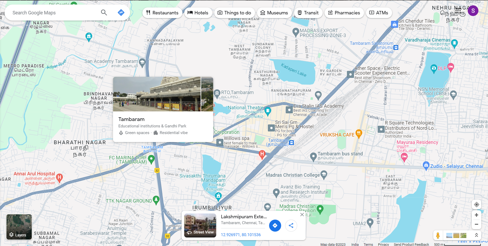

# Places Around Me

#Name: SUNIL KUMAR T

#Ref no: 23001650
# Aim:
To develop a website to display details about the places around my house.

# Design Steps:

## Step 1:
Take screenshots of places around your house using Google Maps.

## Step 2:
Identify a minimum of five different locations and mark them using image maps.

## Step 3:
Develop a webpage(minimum of 50 words) for each location and link it to the image region.

## step 4:
mention the co-ordinates and the link to be appeared when clicked.


# Code:

## hht.html
```
<html>
<head>
<title> my city</title>
</head>
<body>
<h1 align="center">
<font color="red"><b>Tambaram</b></front>
</h1>
<h3 align="center">
<font color="blue"><b>Sunil kumar T (23001650)</b></fornt>
</h3>
<center>

<map name="Mycity">
<area shape="rect" coords="200,300,300,400" href="tambaram.html" title="My Home Town">
<area shape="rect" coords="200,500,600,600" alt="bus stand" href="bus.html">
<area shape="rect" coords="200,300,900,900" alt="College" href="mcc.html">
<area shape="circle" coords="28,26,303,300" alt="park" href="park.html">
<area shape="rect" coords="300,100,800,800" alt="railway station" href="railway.html">
</map>
</center>
</body>
</html>
```
## mcc.html

```
<!DOCTYPE html>
<html>
    <head>
        <title>MADRAS CHRISTEIN COLLEGE</title>
    </head>
    <body>
        MADRAS CHRISTEIN COLLEGE:
        <br>
        about MCC:
        <br>Madras Christian College traces its origin to the General Assembly School founded by the Rev. John Anderson, a Missionary from the Church of Scotland, on 3rd April 1837. Anderson was a pioneer in introducing English medium education in South India. He was ably assisted by Rev.
        
    </body>
</html>
```
## Tambaram.html

```
<!DOCTYPE html>
<html>
    <head>
        <title>Tambaram</title>
    </head>
    <body>
        Tambaram:
        <br>
        about Tambaram:
        <br>Tambaram is an ancient town referred to as Taamapuram in an inscription of the 13th century. There are many other places of historical interest more ancient than Old Tambaram within a radius of about 10 kms from it. Implements of Stone Age men have been found in this area and also large stone monuments of the Iron Age. The earliest Pallava stone inscription and a Pallava temple of the 7th century A.D. are found here. Sekkilar, the author of Periapuranam lived here and Sriperumbudoor the birth place of Ramanuja the Vaishnava saint is not very far from this area. One of the famous battles of Pallava history was fought in this region. The later Cholas, the Pandias and the Vijayanagar kings also ruled this region. Even the flowers in the jungle are connected with our history.
        
    </body>
</html>
```
## park.html

```
<!DOCTYPE html>
<html>
    <head>
        <title>park</title>
    </head>
    <body>
        park:
        <br>
        about park:
        <br>
        Big Peaceful place for Tambaram Area People. U can see Morning and Evening, a lot of people Walking with Relax Mind. It reduces work stress when we visit here.
It's just Awesome Place.
    </body>
</html>
```
## bus.html

```
<!DOCTYPE html>
<html>
    <head>
        <title>Tambaram Bus stand</title>
    </head>
    <body>
        Tambaram Bus stand:
        <br>
        about bus stand:
        <br>Tambaram Bus Stand in Tambaram West,Chennai - Best Bus Depot in Chennai 
        
    </body>
</html>
```
## railway.html
```
<!DOCTYPE html>
<html>
    <head>
        <title>Tambaram sanatorium</title>
    </head>
    <body>
        Tambaram sanatorium:
        <br>
        about Tambaram sanatorium:
        <br>
        Tambaram Sanatorium railway station is one of the railway stations of the Chennai Beach–Chengelpet section of the Chennai Suburban Railway Network. It serves the neighbourhood of Tambaram Sanatorium and surrounding areas. It is situated about 27 km from Chennai Beach and has an elevation of 32 m (105 ft) above sea level.
    </body>
</html>
```


# Output:


# Result:
therefore, when we click a particular point on the image a webpage about the place will appear.

